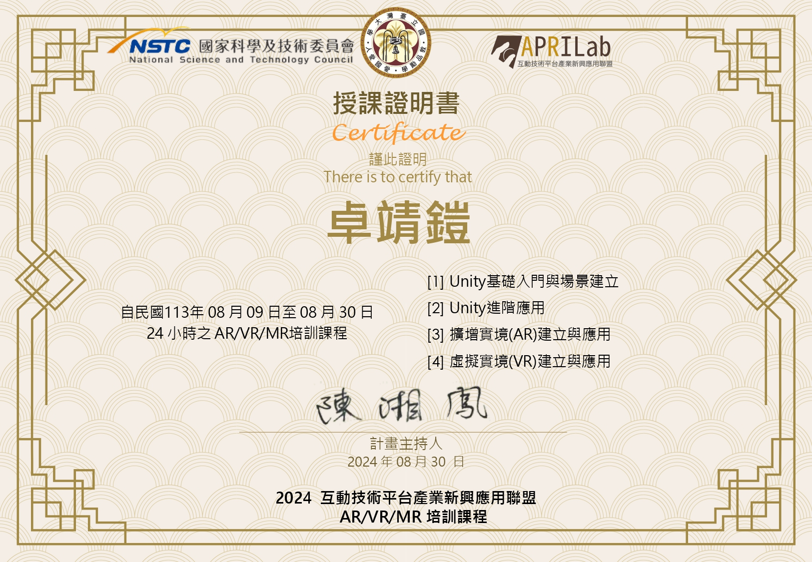

# 互動技術平台產業新興應用聯盟專案

此專案目的在於讓學員熟悉 HTC Vive 系統，並結合 Unity 來開發屬於自己的專案，藉此探索虛擬實境 (VR) 世界及其應用潛力。課程設計注重理論與實作的結合，從基礎的設備介紹到專案開發，循序漸進地帶領學員掌握 VR 技術的核心要素。

課程將從 HTC Vive 系列設備的介紹開始，分析各型號（如 Vive Pro、Vive Pro 2 等）的定位、基礎功能與應用場景，幫助學員理解不同設備在專業與消費市場中的角色。透過比較，學員將能夠選擇最適合自身需求的硬體，並了解其技術限制與優勢。

接著，課程將涵蓋基礎的裝置設定，包括安裝 Lighthouse 基站、校準追蹤空間，以及如何透過 SteamVR 平台將 HTC Vive 與電腦連接，實現虛擬環境的交互操作。此外，學員還將學習如何檢視並修改系統設定，從而將原本為 Oculus 設計的專案順利移植到 HTC Vive 平台，進一步熟悉多平台開發的技巧。

在後續的 Unity 教學環節中，學員將學習如何在 Unity 中結合 HTC Vive 的 SDK，建立具有交互性的虛擬場景與物件。課程將涵蓋 Unity 的基礎操作，如場景設計、腳本撰寫與物理模擬，同時介紹如何整合 HTC Vive 的追蹤與輸入功能，以實現更為自然的用戶交互體驗。最終，學員將結合前三堂課中學到的 Unity 知識，完成一個屬於自己的簡易小遊戲專案。使自己能夠熟練操作 HTC Vive 系統，還能具備基礎的 Unity 開發能力。

